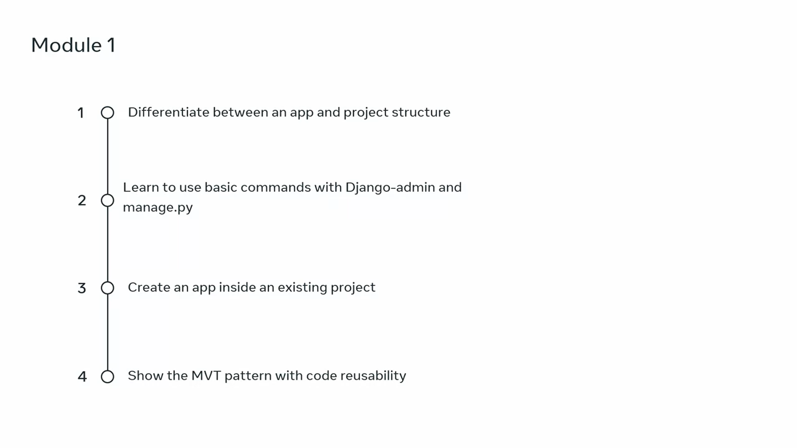

# Introduction to Django Web Framework

# What is Django?

### Summary of the Topic

**When building web applications**, developers and development teams have two choices: **build everything themselves** or **use a web application framework**. A **web application framework** is like a toolkit containing all the components needed for application development. By using a framework, developers can focus on the application's unique features instead of spending time developing common features such as **user login and authentication** or **building an admin dashboard**.

In this video, you are introduced to the **Django framework**, including its real-world applications and the types of web applications that use it.

### Key Points about Django

1. **Django is an open-source web development framework** written in Python.
2. It was first created for a **newspaper publisher web application**, making it excellent for projects requiring high volumes of text content, media files, and heavy traffic.
3. The **open-source nature of Django** has resulted in its rapid growth and adaptation for various web applications.
4. Django allows easy integration with many tools and languages, supported by other Python libraries.
5. Django provides **robust, secure, adaptable, and scalable functionalities**, with features like **templates, libraries, and APIs**.
6. It is popular in industries such as **eCommerce, healthcare, finance, transport, travel, social media**, and more.
7. Django allows separation of features, enabling organizations to create projects using more than one framework. For example, using Django for the backend and connecting it to a frontend framework via an API.
8. On the backend, developers can utilize powerful features, including **email systems for notifications, data analysis tools, admin dashboards**, and **development tools for online marketplaces and booking systems**.

### Real-World Applications of Django

- **Machine Learning and Artificial Intelligence**: Django can deploy machine learning algorithms using APIs, RPCs, and WebSockets. It can handle many API endpoints, enabling fast integration and deployment of models.
- **Scalable Web Applications**: Django's scalability is a major reason for its popularity. It's common for web applications and tech companies to start small but expand rapidly. Examples include social media apps like Instagram.
- **Software as a Service (SaaS) Applications**: Django is a popular choice for cloud storage applications because it provides asynchronous views, allowing concurrent service execution and significantly increasing performance.
- **Over-the-Top (OTT) Media Platforms**: Django is used for audio and video streaming services. Its fault tolerance, open-source nature, and comprehensive documentation make it ideal for large projects.

### Conclusion

Django is favored for building web applications because it helps developers and organizations avoid reinventing the wheel. Its **ease of adaptation, robustness, supportive open-source community, comprehensive documentation**, and **security** make it popular. The video provides an overview of Django and its use in real-world web applications.

# How is Django used in the real world?

### Summary of the Video

In this video, **Jeremy, a software engineer at Meta**, introduces himself and discusses the **Django web framework**. He emphasizes the importance of learning technologies used in real life, highlighting Django as the most popular Python web framework.

### Key Points

1. **Introduction to Django**:
   - Django is a framework that lets you process **HTTP requests** from end-users and return content back to them, such as an HTML page.
   - It powers the interaction from users requesting or sending data, to processing the data and returning it to the users.

2. **Personal Experience with Django**:
   - Jeremy shares that Django was the first web framework he learned, using it for **hackathons** and **undergraduate research**.
   - He finds it **super lightweight** and **easy to spin up**, making it a great tool for rapid prototyping or creating a minimum viable product.

3. **Built-in Tools**:
   - Django comes with a lot of tools already built in, such as **database interaction** and **HTTP request processing**.
   - These tools are first-class features within the framework, meaning they are integral and easily accessible.

4. **Comparison with Flask**:
   - Jeremy compares Django with Flask, another Python web framework.
   - Flask is recommended if you need something **lightweight** and don’t require extensive features like database management.
   - Django is suggested if you want a lot of functionality built-in and need to build complex applications quickly.

5. **Learning Curve**:
   - One challenge of Django is its learning curve, as it comes with many built-in tools that require understanding.
   - Learning Django provides exposure to the **full stack**, including **database interaction**, **front-end code**, and **web server code**.

6. **Advocacy for Hands-On Learning**:
   - Jeremy advocates for **learning by doing** and engaging in personal projects to strengthen development skills.
   - He recommends coding alongside the course content to make learning more effective and accelerated.

7. **Industry Usage**:
   - Django is used in the industry to provide a complete understanding of the **software development cycle**.
   - It helps bridge the gap between the **back-end database** and the **front-end client** through the web server.

### Conclusion

Jeremy encourages learners to engage in **interactive learning** and **personal projects** to become stronger developers. He wishes luck to those continuing their journey to becoming well-rounded software engineers, highlighting the practical applications and benefits of learning Django.

# Course Syllabus

**Course Syllabus**

This beginner course prepares learners for a career in Django development.

**Prerequisites**  
To succeed, you should have fundamental knowledge of:
- **HTML and CSS**
- **Python**
- **MySQL**

You also need basic internet navigation skills and eagerness to start coding in Django!

**By the End of the Course, You Will Be Able To:**
- **Design a Django web application** using Python, HTML, and CSS.
- **Describe and implement the HTTP request-response cycle** by creating views, routes, and templates.
- **Describe and build a data model** to create database tables and dynamic web forms.
- **Explore the Django Template Language** to create dynamic webpages displaying data from a database.
- **Create, share, and test your web application** using industry-standard best practices and guidelines.

**Course Background**  
The course is structured around the fictional **Little Lemon restaurant**. 
- The current website, designed with **HTML and CSS**, is a single page.
- The owners, **Mario and Adrian**, want to create a **database-driven web application** using Django.
- They need a **prototype** that allows managers to update the **menu information** seasonally.

**Course Content**  
Each module equips you with the knowledge and skills needed to create a web application using Django. The course includes four main modules:

**Module 1**  
- **Introduction to Django** and its real-world applications.
- **Setting up your computer** with Visual Studio Code and Python.
- **Creating a Django web application** with its two components: projects and apps.
- Using command line tools **"Django admin"** and **"manage.py"**.
- Understanding the **MVT (Model-View-Template) pattern** and **code reusability**.

**Module 2**  
- **Views** in Django and processing basic **HTTP requests**.
- Using **request and response objects** for common operations.
- Associating parameters with **HTTP methods** such as GET, PUT, POST, and DELETE.
- Creating URL patterns using **regular expressions**.
- Handling **HTTP errors** at various levels.
- Implementing **class-based views** and reusing them.

**Module 3**  
- Working with **Models**.
- Using the **Django admin panel** to manage users and groups.
- Interacting with the database using the **QuerySet API**.
- Creating forms and using the **Form API**.
- Setting up a **MySQL database** and applying migrations.

**Module 4**  
- Creating and using **templates** and the **template language** to generate HTML.
- Integrating **third-party libraries**.
- Exploring **debugging and testing** in Django.

**Module 5: Graded Assessment**  
- Apply your skills to complete the prototype for the **Little Lemon website**.
- Complete the final **graded assessment**.
- Reflect on the course content and explore your next steps in learning Django.

# Installing Python (optional for Windows users)

# Working with labs in this course

# Additional resources

Certainly! Here is a summary of the course content and a link to all the resources you will find helpful:

Course Summary:
1. Introduction to Django: Learn the basics of Django, its features, and how to set up a development environment.
2. Views: Understand how to create views in Django and handle HTTP requests and responses.
3. Models: Dive into Django's powerful ORM (Object-Relational Mapping) and learn how to work with databases.
4. Templates: Discover how to create dynamic and reusable templates in Django for rendering HTML.
5. Course summary and graded project assessment: Wrap up the course by reviewing the key concepts and completing a graded project.

Resources:
- Django official website: [Django Official Website](https://www.djangoproject.com/)
- Django documentation: [Django Documentation](https://docs.djangoproject.com/)
- Installing VS Code on Mac - Official: [Installing VS Code on Mac](https://code.visualstudio.com/docs/setup/mac)
- Installing VS Code on Windows - Official: [Installing VS Code on Windows](https://code.visualstudio.com/docs/setup/windows)
- Django installation - Official: [Django Installation](https://docs.djangoproject.com/en/3.2/topics/install/)
- Install Django on Windows: [Install Django on Windows](https://docs.djangoproject.com/en/3.2/howto/windows/)
- Setting up Virtual environment in Python - venv (Windows and MacOS): [Setting up Virtual Environment](https://docs.python.org/3/tutorial/venv.html)
