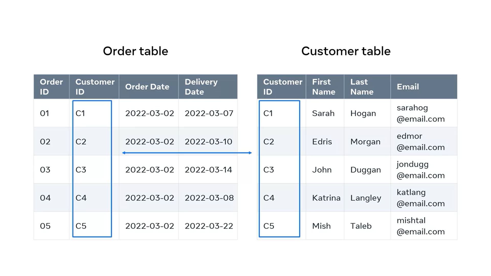

# What is a database?

- **Data** is facts and figures about anything. It can be information about a person, an online purchase, or any other type of information.
- **Databases** are electronic storage systems that organize data systematically. They make data more manageable, efficient, and secure.
- Databases are used in many real-world examples, such as banks storing customer data and transactions, and hospitals storing patient and staff data.
- A **database** looks like data organized systematically, typically in the form of a spreadsheet or a table.
- **Entities** are like tables in a database. They store data related to specific elements, such as customers or products.
- **Attributes** are the features or characteristics of an entity. They are stored in columns in a table.
- Each row in a table represents an instance of an entity, such as a specific customer or product.
- There are different types of databases, such as 
    - object-oriented databases
    - graph databases and 
    - document databases.
- Databases can be hosted on dedicated machines or on the cloud, which allows for lower-cost data management and accessibility through the internet.

# How is data related?

- **Data in a database needs to be related to other data** to make it meaningful.
- For example, imagine you're managing the database of a large online store. You have an **order table** and a **customer table**.
- To find the details of a customer's order, you check the **order number against the customer ID**. This establishes a link between the data in the tables.
- In the customer table, you have fields like **Customer ID, FirstName, LastName, and Email**. Each row in the table contains data for each of these fields. These rows are known as **records**.
- Each row and record in the customer table represents a unique **customer instance or entity**.
- To avoid confusion, you can use a field that contains only unique values, like the **customer ID**. This is called a **primary key field**.
- The order table also has fields and records. The **primary key field** in this table is the **order ID**.
- The **customer ID field in the order table** is there to identify who placed the order. It connects the order table to the customer table.
- The customer ID field in the order table is called a **foreign key field**. It connects to the **primary key field (customer ID) in the customer table**.

- This way, the data in the two tables are related, and you can pull data in a meaningful way from both tables.

# Relational data example charts

Sure! In simple terms, this topic is about databases and how they are used for back-end development. **Databases** are like organized storage spaces for **data**. They collect and store data from different sources, like customer orders or student enrollments. The data is then processed and presented in a way that is useful and meaningful to people.

Here's a detailed summary of the topic:

- **Data** is collected and stored in **databases** for various reasons.
- Organizing and processing data helps make it more useful and meaningful.
- **Charts** are used to present data visually and help people understand it better.
- **Bar charts** are used to show categorical data with rectangular bars.
- **Bubble charts** compare different values using bubble sizes.
- **Line charts** show data points connected by lines to highlight trends.
- **Pie charts** show how different data points make up a whole.
- Choosing the right chart depends on the audience, the data, and the goal.
- Experimenting with different charts can help find the best option.

# Alternative types of databases

- **Databases** are used to store and organize data.
- They have evolved in response to new trends like **big data** and **cloud databases**.
- **NoSQL databases** have become popular because they provide a flexible structure for storing data in various formats.
- Examples of noSQL databases include **document databases**, **key-value databases**, and **graph databases**.
- **Big data** refers to complex data that can grow exponentially over time.
- It includes structured, semi-structured, and unstructured data from sources like social media platforms, online shopping sites, and the Internet of Things (IoT).
- **Cloud databases** are a trend where organizations move their data storage to the cloud to avoid the difficulties of managing physical servers.
- Cloud storage services like Dropbox and iCloud offer a more affordable solution for storing and accessing data.
- **Business intelligence (BI)** is another trend in databases, involving the use of technologies and strategies to analyze data and extract valuable information for making informed business decisions.
- The field of database technology is constantly evolving, and new trends will continue to emerge.

# Additional Resources

Additional resources
The following resources are some additional reading material that introduces you to the concept of a database, different types of databases, about relational databases in specific and also about the history of databases. These will add to the knowledge that you've got on these areas throughout this lesson.

- Oracle 
(https://www.oracle.com/uk/database/what-is-database/)

- Javapoint 
(https://www.javatpoint.com/types-of-databases)

- IBM 
(https://www.ibm.com/topics/relational-databases)

- Tutorialspoint
(https://www.tutorialspoint.com/sql/sql-databases.htm)

- Graphdatamodeling
(http://graphdatamodeling.com/GraphDataModeling/History.html)

