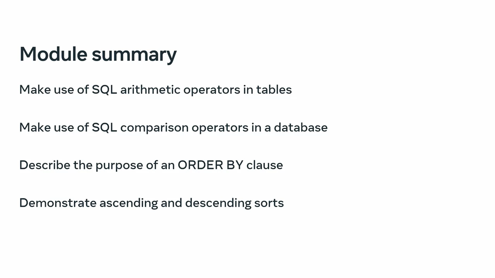
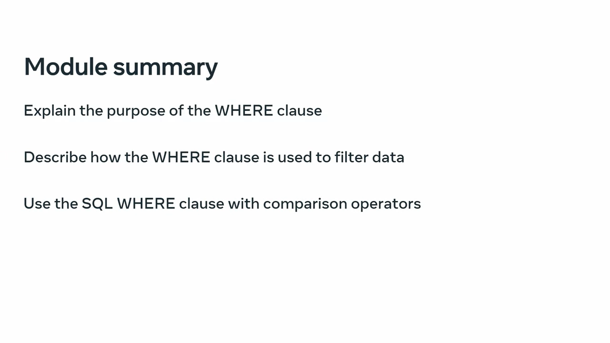
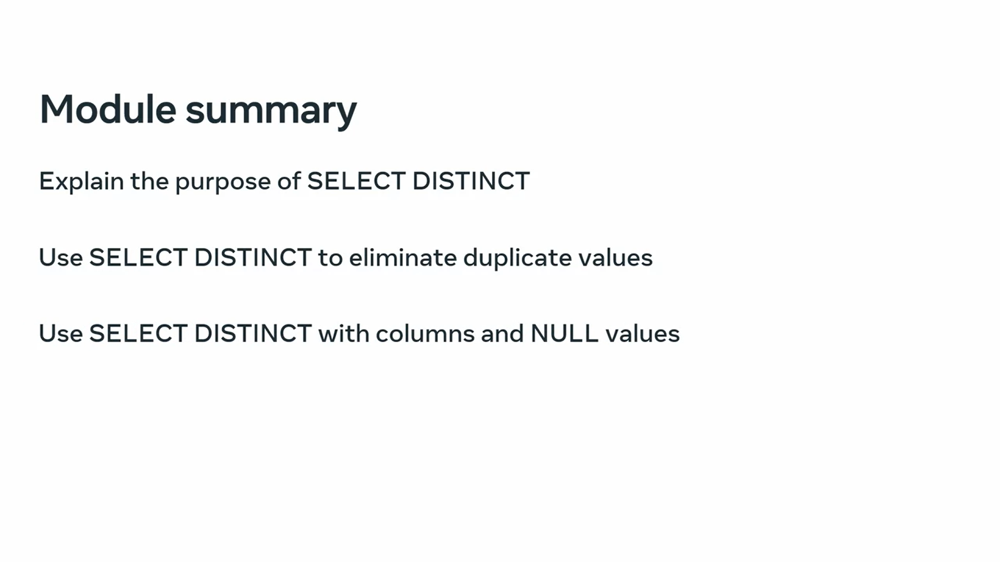

# ORDER BY clause

### Using the SQL ORDER BY Clause for Sorting Data

The `ORDER BY` clause in SQL is used to sort data returned by a query in either ascending or descending order. This clause is highly flexible, allowing for sorting by one or multiple columns, and is essential for organizing query results meaningfully.

#### Syntax of the ORDER BY Clause

The basic syntax of the `ORDER BY` clause is as follows:
```sql
SELECT column1, column2, ...
FROM table_name
ORDER BY column1 [ASC | DESC], column2 [ASC | DESC], ...;
```

- **`column1, column2, ...`**: The columns by which to sort the results.
- **`ASC`**: Sorts the column in ascending order (default).
- **`DESC`**: Sorts the column in descending order.

#### Examples of Using the ORDER BY Clause

Consider the following table named `students`:

| student_id | first_name | last_name | date_of_birth | nationality |
|------------|------------|-----------|---------------|-------------|
| 1          | John       | Doe       | 1995-05-15    | USA         |
| 2          | Jane       | Smith     | 1998-07-21    | Canada      |
| 3          | Emily      | Jones     | 1997-01-10    | USA         |
| 4          | Michael    | Brown     | 1995-08-30    | Australia   |
| 5          | Sarah      | Wilson    | 1999-12-12    | Canada      |

##### Sorting by a Single Column

**Example 1**: Sort by `nationality` in ascending order.
```sql
SELECT student_id, first_name, last_name, nationality
FROM students
ORDER BY nationality ASC;
```
**Result**:
| student_id | first_name | last_name | nationality |
|------------|------------|-----------|-------------|
| 4          | Michael    | Brown     | Australia   |
| 2          | Jane       | Smith     | Canada      |
| 5          | Sarah      | Wilson    | Canada      |
| 1          | John       | Doe       | USA         |
| 3          | Emily      | Jones     | USA         |

Note: `ASC` is optional because it is the default order.

**Example 2**: Sort by `nationality` in descending order.
```sql
SELECT student_id, first_name, last_name, nationality
FROM students
ORDER BY nationality DESC;
```
**Result**:
| student_id | first_name | last_name | nationality |
|------------|------------|-----------|-------------|
| 1          | John       | Doe       | USA         |
| 3          | Emily      | Jones     | USA         |
| 2          | Jane       | Smith     | Canada      |
| 5          | Sarah      | Wilson    | Canada      |
| 4          | Michael    | Brown     | Australia   |

##### Sorting by Multiple Columns

**Example 3**: Sort by `nationality` in ascending order and `date_of_birth` in descending order.
```sql
SELECT student_id, first_name, last_name, nationality, date_of_birth
FROM students
ORDER BY nationality ASC, date_of_birth DESC;
```
**Result**:
| student_id | first_name | last_name | nationality | date_of_birth |
|------------|------------|-----------|-------------|---------------|
| 4          | Michael    | Brown     | Australia   | 1995-08-30    |
| 5          | Sarah      | Wilson    | Canada      | 1999-12-12    |
| 2          | Jane       | Smith     | Canada      | 1998-07-21    |
| 1          | John       | Doe       | USA         | 1995-05-15    |
| 3          | Emily      | Jones     | USA         | 1997-01-10    |

In this example, the `nationality` column is sorted in ascending order, and within each nationality group, the `date_of_birth` column is sorted in descending order.

### Key Points

1. **Default Order**: If no order is specified (ASC or DESC), SQL sorts the data in ascending order by default.
2. **Multiple Columns**: You can sort by multiple columns by specifying the columns separated by commas in the `ORDER BY` clause. Each column can have its own sort direction (ASC or DESC).
3. **Data Type Influence**: The type of data in the columns affects how sorting is performed:
    - Numeric columns are sorted numerically.
    - Text columns are sorted alphabetically.
    - Date columns are sorted chronologically.

By understanding and utilizing the `ORDER BY` clause effectively, you can organize and present your data in a way that is more meaningful and useful for analysis and reporting.

# Types of ordering / sorting

In SQL, the `ORDER BY` clause is a powerful tool for sorting data returned by a query. It allows for both ascending (ASC) and descending (DESC) ordering, which can be applied to different data types such as numeric, text, and dates. This reading explores practical examples of using the `ORDER BY` clause for sorting data in various scenarios.

#### Basic Syntax of the ORDER BY Clause

The basic syntax for the `ORDER BY` clause is:
```sql
SELECT column1, column2, ...
FROM table_name
ORDER BY column_name [ASC | DESC];
```
- **`column_name`**: The column by which to sort the results.
- **`ASC`**: Sorts the column in ascending order (default).
- **`DESC`**: Sorts the column in descending order.

#### Examples of Sorting by a Single Column

Consider a `customers` table with the following structure:

| CustomerId | FirstName | LastName | City     |
|------------|-----------|----------|----------|
| 1          | John      | Doe      | New York |
| 2          | Jane      | Smith    | Boston   |
| 3          | Michael   | Brown    | Chicago  |
| 4          | Emily     | Johnson  | Dallas   |
| 5          | Sarah     | Wilson   | Atlanta  |

**Example 1: Sorting by Numeric Column**

To sort the `customers` table by `CustomerId` in descending order:
```sql
SELECT * 
FROM customers 
ORDER BY CustomerId DESC;
```
**Result**:

| CustomerId | FirstName | LastName | City     |
|------------|-----------|----------|----------|
| 5          | Sarah     | Wilson   | Atlanta  |
| 4          | Emily     | Johnson  | Dallas   |
| 3          | Michael   | Brown    | Chicago  |
| 2          | Jane      | Smith    | Boston   |
| 1          | John      | Doe      | New York |

**Example 2: Sorting by Text Column**

To sort the `customers` table by `City` in ascending order:
```sql
SELECT * 
FROM customers 
ORDER BY City;
```
**Result**:

| CustomerId | FirstName | LastName | City     |
|------------|-----------|----------|----------|
| 5          | Sarah     | Wilson   | Atlanta  |
| 2          | Jane      | Smith    | Boston   |
| 3          | Michael   | Brown    | Chicago  |
| 4          | Emily     | Johnson  | Dallas   |
| 1          | John      | Doe      | New York |

To sort the `customers` table by `City` in descending order:
```sql
SELECT * 
FROM customers 
ORDER BY City DESC;
```
**Result**:

| CustomerId | FirstName | LastName | City     |
|------------|-----------|----------|----------|
| 1          | John      | Doe      | New York |
| 4          | Emily     | Johnson  | Dallas   |
| 3          | Michael   | Brown    | Chicago  |
| 2          | Jane      | Smith    | Boston   |
| 5          | Sarah     | Wilson   | Atlanta  |

**Example 3: Sorting by Date Column**

Consider an `invoices` table with the following structure:

| InvoiceId | BillingCity | InvoiceDate |
|-----------|-------------|-------------|
| 1         | New York    | 2024-01-15  |
| 2         | Boston      | 2023-11-21  |
| 3         | Chicago     | 2024-02-10  |
| 4         | Dallas      | 2024-03-30  |
| 5         | Atlanta     | 2023-12-12  |

To sort the `invoices` table by `InvoiceDate` in ascending order:
```sql
SELECT * 
FROM invoices 
ORDER BY InvoiceDate;
```
**Result**:

| InvoiceId | BillingCity | InvoiceDate |
|-----------|-------------|-------------|
| 2         | Boston      | 2023-11-21  |
| 5         | Atlanta     | 2023-12-12  |
| 1         | New York    | 2024-01-15  |
| 3         | Chicago     | 2024-02-10  |
| 4         | Dallas      | 2024-03-30  |

To sort the `invoices` table by `InvoiceDate` in descending order:
```sql
SELECT * 
FROM invoices 
ORDER BY InvoiceDate DESC;
```
**Result**:

| InvoiceId | BillingCity | InvoiceDate |
|-----------|-------------|-------------|
| 4         | Dallas      | 2024-03-30  |
| 3         | Chicago     | 2024-02-10  |
| 1         | New York    | 2024-01-15  |
| 5         | Atlanta     | 2023-12-12  |
| 2         | Boston      | 2023-11-21  |

#### Sorting by Multiple Columns

To sort data by multiple columns, you can list the columns separated by commas, specifying the sort order for each.

**Example 4: Sorting by Multiple Columns**

To sort the `invoices` table by `BillingCity` in ascending order and `InvoiceDate` in descending order:
```sql
SELECT * 
FROM invoices 
ORDER BY BillingCity ASC, InvoiceDate DESC;
```
**Result**:

| InvoiceId | BillingCity | InvoiceDate |
|-----------|-------------|-------------|
| 5         | Atlanta     | 2023-12-12  |
| 2         | Boston      | 2023-11-21  |
| 3         | Chicago     | 2024-02-10  |
| 4         | Dallas      | 2024-03-30  |
| 1         | New York    | 2024-01-15  |

Here, the `BillingCity` column is sorted alphabetically, and within each city, the `InvoiceDate` is sorted from latest to earliest.

### Summary

The `ORDER BY` clause in SQL is essential for sorting data in a meaningful way. Key points to remember include:

1. **Types of Ordering**: 
   - **Ascending (ASC)**: Sorts data from smallest to largest, alphabetically (A to Z) for text.
   - **Descending (DESC)**: Sorts data from largest to smallest, reverse alphabetically (Z to A) for text.
   
2. **Default Behavior**: If no order is specified, data is sorted in ascending order by default.

3. **Multiple Columns**: You can sort by multiple columns by listing them separated by commas, and each column can have its own sort order.

Understanding and using the `ORDER BY` clause effectively can greatly enhance the usability and readability of your SQL query results.

# WHERE clause
### Using the WHERE Clause in SQL

The `WHERE` clause in SQL is a powerful tool used to filter data based on specific conditions. This clause can be utilized in `SELECT`, `UPDATE`, and `DELETE` statements to refine the results and target specific records. Let's explore how to use the `WHERE` clause effectively with various operators through practical examples.

#### Basic Syntax of the WHERE Clause

The basic syntax for the `WHERE` clause in a `SELECT` statement is:
```sql
SELECT column1, column2, ...
FROM table_name
WHERE condition;
```
- **`condition`**: A logical expression used to filter records.

#### Example Scenarios Using the WHERE Clause

**Scenario 1: Filtering by Text Value**

Suppose the admin department wants to generate a report for students in the engineering faculty. The `students` table includes columns like `student_id`, `first_name`, `last_name`, and `faculty`.

**SQL Query**:
```sql
SELECT * 
FROM students 
WHERE faculty = 'Engineering';
```
This query retrieves all records where the `faculty` column value is 'Engineering'.

**Scenario 2: Filtering by Numeric Value**

To find students with a specific ID, say `student_id` equals 01:
```sql
SELECT * 
FROM students 
WHERE student_id = 1;
```
This retrieves the student record with `student_id` 1.

#### Using Different Operators in the WHERE Clause

1. **Comparison Operators**:
   - Equal to (`=`): Filters records where the column value matches the specified value.
   - Greater than (`>`): Filters records where the column value is greater than the specified value.
   - Less than (`<`): Filters records where the column value is less than the specified value.
   - Greater than or equal to (`>=`): Filters records where the column value is greater than or equal to the specified value.
   - Less than or equal to (`<=`): Filters records where the column value is less than or equal to the specified value.
   - Not equal to (`<>`): Filters records where the column value does not match the specified value.

**Example**:
To find students older than 20 years:
```sql
SELECT * 
FROM students 
WHERE age > 20;
```

2. **BETWEEN Operator**:
   - Used to filter records within a specific range of values (inclusive).

**Example**:
To find students born between January 1, 2010, and May 30, 2010:
```sql
SELECT * 
FROM students 
WHERE DOB BETWEEN '2010-01-01' AND '2010-05-30';
```

3. **LIKE Operator**:
   - Used to filter records based on a specified pattern.
   - Wildcards:
     - `%`: Represents zero or more characters.
     - `_`: Represents a single character.

**Example**:
To find students in the science faculty:
```sql
SELECT * 
FROM students 
WHERE faculty LIKE 'Sc%';
```
This filters records where the `faculty` column value starts with 'Sc'.

4. **IN Operator**:
   - Used to filter records where the column value matches any value in a specified list.

**Example**:
To find students studying in the USA or UK:
```sql
SELECT * 
FROM students 
WHERE country IN ('USA', 'UK');
```
This filters records where the `country` column value is either 'USA' or 'UK'.

#### Practical Examples for the Admin Department

**Example 1: Students in the Engineering Faculty**
```sql
SELECT * 
FROM students 
WHERE faculty = 'Engineering';
```

**Example 2: Students Aged Between 18 and 22**
```sql
SELECT * 
FROM students 
WHERE age BETWEEN 18 AND 22;
```

**Example 3: Students Whose First Name Starts with 'A'**
```sql
SELECT * 
FROM students 
WHERE first_name LIKE 'A%';
```

**Example 4: Students from Specific Countries**
```sql
SELECT * 
FROM students 
WHERE country IN ('USA', 'Canada', 'UK');
```

### Summary

The `WHERE` clause in SQL is essential for filtering data based on specific conditions. It supports various operators to refine queries effectively:
- **Comparison operators**: `=`, `>`, `<`, `>=`, `<=`, `<>`
- **BETWEEN**: For range-based filtering
- **LIKE**: For pattern-based filtering
- **IN**: For filtering based on a list of values

By mastering the `WHERE` clause and its operators, you can create precise and efficient queries to meet diverse reporting and data retrieval needs in any database application.

# WHERE Clause uses

### Using the WHERE Clause in SQL

The `WHERE` clause in SQL is essential for filtering data based on specified conditions. This clause can be used in `SELECT`, `UPDATE`, and `DELETE` statements to refine results and target specific records. Here's a detailed exploration of the `WHERE` clause, including examples and scenarios for its use.

#### Purpose and Syntax

The `WHERE` clause allows you to specify conditions to filter records from a table. The syntax is as follows:
```sql
SELECT column1, column2, ...
FROM table_name
WHERE condition;
```

- **`condition`**: A logical expression used to filter records.

### Comparison Operators

Comparison operators are used to compare values in the `WHERE` clause.

| Operator | Description |
|----------|-------------|
| =        | Checks if the values of two operands are equal. |
| !=       | Checks if the values of two operands are not equal. |
| <>       | Checks if the values of two operands are not equal. |
| >        | Checks if the left operand is greater than the right operand. |
| <        | Checks if the left operand is less than the right operand. |
| >=       | Checks if the left operand is greater than or equal to the right operand. |
| <=       | Checks if the left operand is less than or equal to the right operand. |
| !<       | Checks if the left operand is not less than the right operand. |
| !>       | Checks if the left operand is not greater than the right operand. |

### Logical Operators

Logical operators combine multiple conditions.

| Operator | Description |
|----------|-------------|
| ALL      | Compares a single value to all values in another value set. |
| AND      | Combines multiple conditions; all must be true. |
| ANY      | Compares a value to any applicable value in the list as per the condition. |
| BETWEEN  | Searches for values within a specified range. |
| EXISTS   | Searches for the presence of a row in a table that meets a criterion. |
| IN       | Compares a value to a list of literal values. |
| LIKE     | Compares a value to similar values using wildcards. |
| NOT      | Negates a logical condition. |
| OR       | Combines multiple conditions; at least one must be true. |
| IS NULL  | Compares a value with a NULL value. |
| UNIQUE   | Searches for unique values in a column. |

### Example Scenarios

**Scenario 1: Filtering by Numeric Value**

To fetch invoices with a total value greater than $2:
```sql
SELECT * 
FROM invoices 
WHERE Total > 2;
```
This query returns invoices where the `Total` is more than $2.

**Scenario 2: Combining Multiple Conditions with AND**

To list invoices with a total value over $2 and the billing country as the USA:
```sql
SELECT * 
FROM invoices 
WHERE Total > 2 AND BillingCountry = 'USA';
```
Both conditions must be true for records to be included in the result.

**Scenario 3: Combining Multiple Conditions with OR**

To list invoices where the billing country is the USA or France:
```sql
SELECT * 
FROM invoices 
WHERE BillingCountry = 'USA' OR BillingCountry = 'France';
```
At least one of the conditions must be true for records to be included.

**Scenario 4: Combining AND and OR**

To list invoices with a total value over $2 and the billing country as either the USA or France:
```sql
SELECT * 
FROM invoices 
WHERE Total > 2 AND (BillingCountry = 'USA' OR BillingCountry = 'France');
```
The conditions within parentheses are evaluated as a single expression.

### Advanced Filtering with Other Operators

**BETWEEN Operator**

To find students born between January 1, 2010, and May 30, 2010:
```sql
SELECT * 
FROM students 
WHERE DOB BETWEEN '2010-01-01' AND '2010-05-30';
```
This filters records within the specified date range.

**LIKE Operator**

To find students in the science faculty:
```sql
SELECT * 
FROM students 
WHERE faculty LIKE 'Sc%';
```
The `%` wildcard matches any number of characters, so this finds all records where `faculty` starts with 'Sc'.

**IN Operator**

To find students from specific countries (USA and UK):
```sql
SELECT * 
FROM students 
WHERE country IN ('USA', 'UK');
```
This filters records where the `country` column value is either 'USA' or 'UK'.

### Summary

The `WHERE` clause is a versatile tool for filtering data in SQL. By understanding and using various comparison and logical operators, you can create precise and efficient queries to retrieve the necessary records from your database. Here’s a quick summary of how to use different operators:

- **Comparison Operators**: `=`, `!=`, `<>`, `>`, `<`, `>=`, `<=`, `!<`, `!>`
- **Logical Operators**: `ALL`, `AND`, `ANY`, `BETWEEN`, `EXISTS`, `IN`, `LIKE`, `NOT`, `OR`, `IS NULL`, `UNIQUE`

By mastering these operators, you can handle a wide range of data filtering scenarios to meet your reporting and data analysis needs.

# Chinhook Database Sample

https://www.kaggle.com/datasets/nancyalaswad90/chinook-sample-database/data

# SELECT DISTINCT clause

### Summary of Using `SELECT DISTINCT` in SQL

When working with a **database containing records of college students from all over the world**, you might need to **generate a list of all the different countries** these students belong to as part of an annual report. Since many students might come from the same country, you need a way to **retrieve the results without any duplicates**. This is where the **`SELECT DISTINCT`** clause comes in handy.

#### **What is `SELECT DISTINCT`?**

- The **`SELECT DISTINCT` statement** is used to **return only distinct (different) values**.
- It **eliminates duplicate values** in the result set.

#### **Basic Usage of `SELECT DISTINCT`**

1. **Imagine a table named `students`** that includes a column `country`.
2. To find out which countries the students are from, you could start with a **basic `SELECT` statement**:
   ```sql
   SELECT country FROM students;
   ```
3. This query might return multiple duplicate records if many students are from the same country.

#### **Eliminating Duplicates**

- To **remove duplicates** and retrieve a unique set of results, modify the query using `SELECT DISTINCT`:
  ```sql
  SELECT DISTINCT country FROM students;
  ```
- This query will return each country only once, eliminating duplicates.

#### **Using `SELECT DISTINCT` with Multiple Columns**

- You can also use `SELECT DISTINCT` with **multiple columns** to get unique combinations of those columns.
- For example, to determine which countries are represented by students in different faculties:
  ```sql
  SELECT DISTINCT faculty, country FROM students;
  ```
- This query will generate each unique **faculty and country combination**.

#### **Handling `NULL` Values**

- **`NULL` values** are considered unique by the `SELECT DISTINCT` clause.
- Suppose there is a student named Julia Smith from the USA, but her `faculty` column is `NULL`:
  ```sql
  SELECT DISTINCT faculty, country FROM students;
  ```
- The result will include a record for Julia with `NULL` as the faculty value and USA as the country, showing that `NULL` is treated as a unique value.

#### **Practical Examples**

- **Example 1**: Basic usage to find distinct countries:
  ```sql
  SELECT DISTINCT country FROM students;
  ```
- **Example 2**: Finding unique combinations of faculty and country:
  ```sql
  SELECT DISTINCT faculty, country FROM students;
  ```
- **Example 3**: Handling `NULL` values in the result set:
  ```sql
  SELECT DISTINCT faculty, country FROM students;
  ```

### Key Points

- **`SELECT DISTINCT`** helps **remove duplicate values** from the result set.
- It can be used with **single or multiple columns**.
- **`NULL` values** are treated as unique by `SELECT DISTINCT`.

By understanding and applying the **`SELECT DISTINCT` statement**, you can efficiently retrieve unique records from your database, making it easier to analyze and report on data without the clutter of duplicate entries.

# SELECT DISTINCT clause in use
### Detailed Summary and Key Points on Using `SELECT DISTINCT` in SQL

#### **The Purpose of `SELECT DISTINCT`**

- **`SELECT DISTINCT`** is used to **retrieve a set of unique values** from one or more columns in a table, eliminating any duplicates.
- It is especially useful when you need to find **unique values** in columns that contain many repeated entries.

#### **Syntax and Basic Usage**

- The basic syntax for `SELECT DISTINCT` is:
  ```sql
  SELECT DISTINCT column1, column2, ...
  FROM table_name;
  ```
- **Example**: To get unique billing countries from an `invoices` table:
  ```sql
  SELECT DISTINCT BillingCountry 
  FROM invoices 
  ORDER BY BillingCountry;
  ```

#### **Practical Examples**

1. **Using `SELECT DISTINCT` on a Single Column**

   - **Scenario**: A table `invoices` has many repeated values in the `BillingCountry` column.
   - **Query**:
     ```sql
     SELECT BillingCountry 
     FROM invoices 
     ORDER BY BillingCountry;
     ```
   - **Result**: This query returns duplicates, showing multiple rows for the same country.
   - **Improved Query**:
     ```sql
     SELECT DISTINCT BillingCountry 
     FROM invoices 
     ORDER BY BillingCountry;
     ```
   - **Improved Result**: This query returns each country only once, eliminating duplicates:
     ```
     +----------------+
     | BillingCountry |
     +----------------+
     | Argentina      |
     | Australia      |
     | Austria        |
     | Belgium        |
     | Brazil         |
     | Canada         |
     | Chile          |
     | Czech Republic |
     | Denmark        |
     | Finland        |
     | France         |
     | Germany        |
     | Hungary        |
     | India          |
     | Ireland        |
     | Italy          |
     | Netherlands    |
     | Norway         |
     | Poland         |
     | Portugal       |
     | Spain          |
     | Sweden         |
     | USA            |
     | United Kingdom |
     +----------------+
     ```

2. **Using `SELECT DISTINCT` on Multiple Columns**

   - **Scenario**: You want to find unique combinations of `BillingCountry` and `BillingCity`.
   - **Query**:
     ```sql
     SELECT DISTINCT BillingCountry, BillingCity 
     FROM invoices 
     ORDER BY BillingCountry, BillingCity;
     ```
   - **Result**: This query returns unique combinations of `BillingCountry` and `BillingCity`, ensuring no duplicates across the specified columns:
     ```
     +----------------+---------------------+
     | BillingCountry | BillingCity         |
     +----------------+---------------------+
     | Argentina      | Buenos Aires        |
     | Australia      | Sidney              |
     | Austria        | Vienne              |
     | Belgium        | Brussels            |
     | Brazil         | Brasília            |
     | Brazil         | Rio de Janeiro      |
     | Brazil         | São José dos Campos |
     | Brazil         | São Paulo           |
     | Canada         | Edmonton            |
     | Canada         | Halifax             |
     | Canada         | Montréal            |
     | Canada         | Ottawa              |
     | Canada         | Toronto             |
     | Canada         | Vancouver           |
     | Canada         | Winnipeg            |
     | Canada         | Yellowknife         |
     | Chile          | Santiago            |
     | Czech Republic | Prague              |
     | Denmark        | Copenhagen          |
     | Finland        | Helsinki            |
     | France         | Bordeaux            |
     | France         | Dijon               |
     | France         | Lyon                |
     | France         | Paris               |
     | Germany        | Berlin              |
     +----------------+---------------------+
     ```

3. **Handling `NULL` Values with `SELECT DISTINCT`**

   - **Scenario**: The `BillingCity` column contains `NULL` values.
   - **Query**:
     ```sql
     SELECT DISTINCT BillingCountry, BillingCity 
     FROM invoices 
     ORDER BY BillingCountry, BillingCity;
     ```
   - **Result**: `SELECT DISTINCT` treats `NULL` values as unique. For example, `Argentina - NULL` and `Australia - NULL` would be considered unique combinations.

4. **Using `DISTINCT` with SQL Aggregate Functions**

   - **Scenario**: You want to count the number of unique countries in a `customers` table.
   - **Query**:
     ```sql
     SELECT COUNT(DISTINCT country) 
     FROM customers;
     ```
   - **Result**: The query counts the number of unique countries:
     ```
     +-------------------------+
     | COUNT(DISTINCT country) |
     +-------------------------+
     |                      24 |
     +-------------------------+
     ```

### **Key Points to Remember**

- **Single Column**: When used with a single column, `SELECT DISTINCT` returns unique values for that column.
- **Multiple Columns**: When used with multiple columns, `SELECT DISTINCT` returns unique combinations of the specified columns.
- **NULL Values**: `SELECT DISTINCT` considers `NULL` values as unique.
- **Aggregate Functions**: `DISTINCT` can be used with aggregate functions like `COUNT`, `AVG`, `MAX`, etc., to apply these functions to unique values.

By leveraging the **`SELECT DISTINCT`** keyword, you can ensure that your queries return unique results, making data analysis and reporting more accurate and meaningful.

# Module summary: SQL operators and sorting and filtering data





